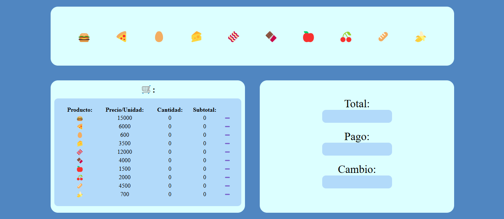

# 🛒 Proyecto Minimercado  
Este es un proyecto interactivo de **Minimercado** hecho con **HTML**, **CSS**, y **JavaScript** que simula una aplicación básica para la selección de productos, cálculo de totales y manejo del pago y cambio del cliente.

## 📋 Descripción del Proyecto  
La aplicación permite agregar productos a un carrito de compras. Cada producto tiene un precio predefinido por unidad. Los cálculos de cantidad, total y cambio se actualizan automáticamente en tiempo real.

---

## 📷 Vista del Proyecto  

---

## ✨ Características Principales  
1. **Selección de Productos**:  
   - Los botones con íconos de productos permiten agregar cantidades individuales.  
   - Al hacer clic en un producto, se incrementa la cantidad en la tabla y se actualiza el subtotal para ese producto.  

2. **Cálculo Automático**:  
   - El precio total por producto se calcula multiplicando la cantidad seleccionada por el precio por unidad.  
   - El campo **"Total"** muestra la suma de todos los subtotales de la tabla.

3. **Pago y Cambio**:  
   - El usuario ingresa el valor de pago en el campo correspondiente.  
   - El campo **"Cambio"** calcula y muestra la diferencia entre el pago del cliente y el total de la compra.  
   - Si el pago es menor al total, se muestra una alerta para avisar al usuario.

---

## 💻 Tecnologías Utilizadas  
- **HTML5**: Estructura principal de la interfaz.  
- **CSS3**: Estilos personalizados para hacer la interfaz visualmente atractiva.  
- **JavaScript**: Lógica interactiva para cálculos y actualizaciones dinámicas.

---

## 📦 Instalación y Uso  
1. **Clona el repositorio**:  
   ```bash
   git clone https://github.com/sxntiBG/minimercado.git
   cd minimercado
   ```

2. **Abre el archivo HTML** en tu navegador preferido:  
   ```bash
   index.html
   ```

3. **Interacción**:  
   - Haz clic en los productos para agregarlos a la tabla.  
   - Ingresa el valor de pago en el campo **Pago**.  
   - Revisa el cambio calculado automáticamente.